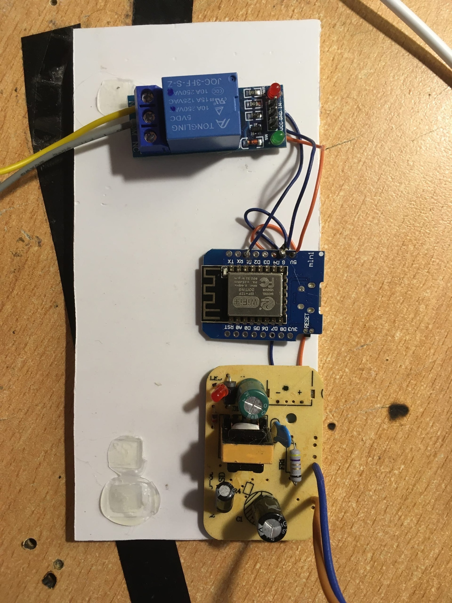
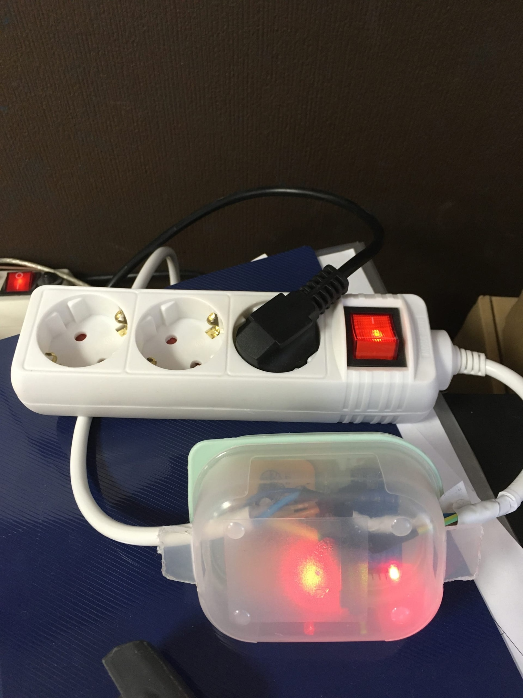

# WifiPowerController
Вай-фай розетка

С началом пандемии всем коллективом ушли на удалёнку , работали по rdp.
Несколько раз случалась неприятность - компьютер зависал намертво, и приходилось ехать на работу перезагружать компьютер.
Для того, что бы не ездить, задумал сделать вай-Фай розетку, что бы можно было по-жоскому ребутнуть компьютер в офисе прямо из дома.
Для этого я взял простенький arduino-подобный модуль wemos mini с вайфаем на борту, релешку с 5вольтовой логикой и плату питания из зарядки телефона.
Собрал и запрограммировал «на коленке».
Затем запихнул в чудесный корпус - мини-контейнер из фикс прайса, предварительно вырезав пару отверстий в боках. Зафиксировал термоклеем - лучшим другом всех диайвайщиков.
Непосредственно на работе перезалил скетч, записав в него имя и пароль вай-фай сети. На рабочем роутере зарезерверовал IP для розетки и прокинул его в интернет.
Теперь могу зайти по рабочему айпишнику:порту и включить\выключить питание компьютера.

